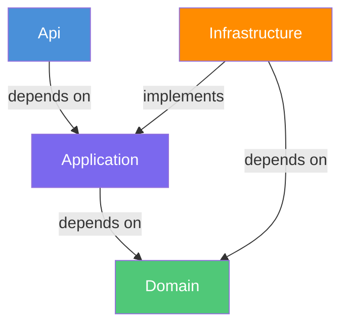
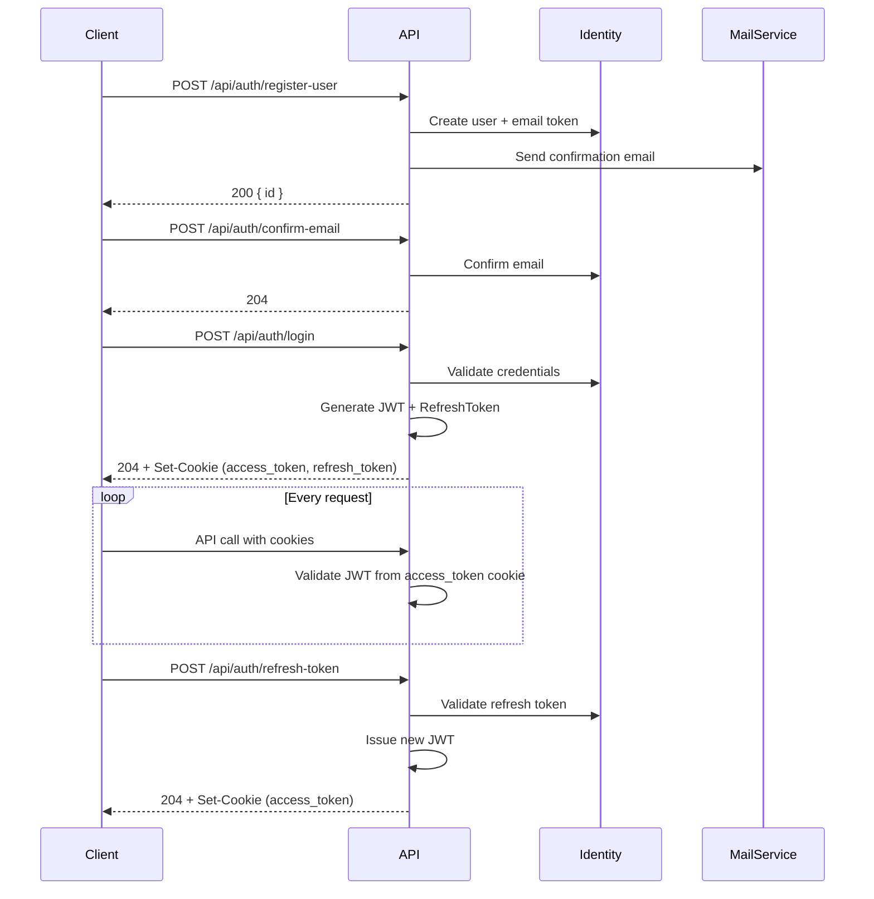
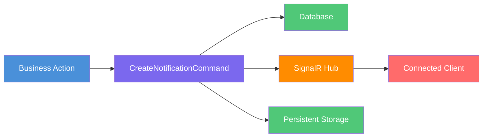

<div align="center">

# TaskManagments

**A production-oriented task management backend built with ASP.NET Core, Clean Architecture, CQRS, MediatR, SQL Server, Redis, SignalR, and JWT-based authentication.**

[](https://dotnet.microsoft.com/)
[](https://learn.microsoft.com/dotnet/csharp/)
[](https://dotnet.microsoft.com/)
[](LICENSE)

[Overview](#overview) | [Features](#features) | [Architecture](#architecture) | [Getting Started](#getting-started) | [API Reference](#api-reference)

</div>

---

## Overview

TaskManagments is a **RESTful, backend-only API** for organizing work into workspaces that contain projects and tasks, with team collaboration features.

- **Workspaces** group users together with role-based access control (Owner, Project Manager, Member).
- **Projects** live inside workspaces and hold the actual tasks.
- **Tasks** have statuses, priorities, deadlines, assignments, comments, and file attachments.
- **Notifications** are pushed in real-time via SignalR when task states change.
- **Reports** provide workspace analytics with PDF export.

> [!NOTE]
> This is an API-only project. A frontend client (e.g. Angular) is expected to consume it. The default base URL is `http://localhost:5102`.

### Who uses it

| Role | Capabilities |
|------|-------------|
| **Admin** | Manage all users, workspaces, view system-wide reports and dashboards |
| **Workspace Owner** | Full control over a workspace: manage members, projects, tasks, and invites |
| **Project Manager** | Create/update projects and tasks within a workspace |
| **Member** | View tasks, comment on tasks, update status of assigned tasks |

---

## Features

### Authentication & Identity
- Registration with email confirmation
- Login via JWT stored in HttpOnly cookies
- Refresh token rotation
- Google OAuth login
- Password reset via OTP (email) or token link
- Email change with confirmation
- Account deletion with email confirmation

### Workspace Management
- Create, update, delete workspaces (soft-delete)
- Invite users with role assignment and expiry
- Accept/reject invitations
- Workspace-scoped role authorization

### Project & Task Management
- Create, update, delete projects within workspaces
- Project status tracking (Active, OnHold, Completed)
- Task creation with assignment, priority, status, and deadlines
- Task filtering by status, priority, search term, and sort order
- Self-service status updates for assigned tasks
- File attachments (PDF, JPG, PNG — up to 50 MB)

### Real-Time Notifications
- SignalR hub at `/notificationHub`
- Push notifications for task assignments, status changes, comments, and invites
- Persistent notification storage with read/unread state

### Reporting & PDF Generation
- Workspace overview reports (members, projects, task breakdown)
- Tasks by status/priority aggregation
- Member performance metrics
- Admin-level system-wide reports
- PDF export via QuestPDF

### Administration
- Global admin dashboard with user/workspace/project/task counts
- Recent activity log
- Member performance reports across all workspaces

---

## Architecture

Clean Architecture with strict dependency rules:

```
Api (Presentation)  -->  Application  -->  Domain  <--  Infrastructure
```



| Layer | Responsibility |
|-------|---------------|
| **Api** | Controllers, SignalR hub, auth policies & handlers, exception handling, CORS |
| **Application** | CQRS features (commands/queries), FluentValidation validators, DTOs, mapping, service/repository interfaces, errors |
| **Domain** | Entities, enums, pagination model, `ISoftDelete` / `IBaseEntity` interfaces (zero external dependencies) |
| **Infrastructure** | EF Core + SQL Server, Redis cache, ASP.NET Identity, MailKit email, background services, repositories |

### Dependency direction

- **Api** depends on **Application** (to dispatch commands/queries)
- **Application** depends on **Domain** (to use entities and interfaces)
- **Infrastructure** depends on **Domain** (to implement interfaces) and references **Application** (for DTOs)
- **Domain** has **zero** external dependencies — it is the innermost layer

---

## Design Patterns & Engineering Practices

| Pattern | Where | Purpose |
|---------|-------|---------|
| **Clean Architecture** | Entire solution | Enforces separation of concerns; business logic is independent of infrastructure |
| **CQRS** | `Application/Features/` | Every feature is a command or query handled by a dedicated handler |
| **Mediator** | MediatR | Decouples controllers from handlers; enables pipeline behaviors |
| **Repository + Unit of Work** | `Infrastructure/Repositories/` | All data access flows through `IUnitOfWork`; repositories are never injected into handlers directly |
| **ErrorOr** | Handlers return `ErrorOr<T>` | Expected failures are returned as values, not thrown as exceptions |
| **FluentValidation** | `ValidationBehavior<T>` pipeline | Request validation runs before every handler; failures short-circuit the pipeline |
| **Mapster** | DTO mapping | Object mapping via `.Adapt<T>()` and `IRegister` mapping classes |
| **Soft Delete** | `ISoftDelete` entities | Entities are marked deleted rather than removed; global query filters exclude them |
| **Options Pattern** | Configuration classes | Strongly-typed configuration for JWT, OTP, mail, Redis settings |
| **Background Services** | Email queues, cleanup | Channel-based in-memory queues for async email processing; periodic removal of unconfirmed users |
| **Global Exception Handling** | `GlobalExceptionHandler` | Maps infrastructure exceptions to RFC 7807 Problem Details responses |

---

## Domain Model

```
User (IdentityUser)
 ├── WorkSpaceUser ──────── WorkSpace
 │                              ├── Project ──────── ProjectTask
 │                              │                      ├── TaskAssignment
 │                              │                      ├── TaskComment
 │                              │                      └── TaskAttachment
 │                              └── WorkSpaceInvite
 ├── Notification
 └── RefreshToken
```

### Key Entities

| Entity | Key | Description |
|--------|-----|-------------|
| `User` | `string` | Extends `IdentityUser`. Has `FirstName`, `LastName`, `DateOfBirth`, custom `RoleId`. |
| `WorkSpace` | `long` | Top-level container. Tracks `CreatedById`, `LastUpdatedById`. Soft-deletable. |
| `WorkSpaceUser` | `long` | Many-to-many join with a `WorkSpaceRole`. |
| `Project` | `long` | Belongs to a `WorkSpace`. Has `ProjectStatus`. Soft-deletable. |
| `ProjectTask` | `long` | Belongs to a `Project`. Has `TaskStatus`, `TaskPriority`, `Deadline`. Soft-deletable. |
| `TaskAssignment` | `long` | Assigns a user to a task. Tracks who assigned and when unassigned. |
| `TaskComment` | `long` | Comments on a task by a user. |
| `TaskAttachment` | `long` | File metadata on a task. |
| `Notification` | `long` | Per-user notification, optionally linked to a task or workspace invite. |
| `RefreshToken` | `long` | JWT refresh tokens with revocation support. |
| `WorkSpaceInvite` | `long` | Invitation to join a workspace with role and expiry. |
| `RecentActivity` | `long` | System-wide activity log for the admin dashboard. |

### Enums

All enums are serialized as **strings** in JSON (`JsonStringEnumConverter`).

| Enum | Values |
|------|--------|
| `Role` | `Admin`, `User` |
| `WorkSpaceRole` | `Owner`, `ProjectManager`, `Member` |
| `ProjectStatus` | `Active`, `OnHold`, `Completed` |
| `ProjectTaskStatus` | `Backlog`, `Todo`, `InProgress`, `Review`, `Done` |
| `TaskPriority` | `Low`, `Medium`, `High`, `Critical` |
| `WorkSpaceInviteStatus` | `Pending`, `Accepted`, `Rejected` |
| `NotificationType` | `TaskAssigned`, `TaskUnassigned`, `TaskStatusUpdated`, `TaskUpdated`, `CommentAdded`, `DueDateReminder`, `TaskDeleted`, `WorkSpaceInvite` |
| `RecentActivityType` | `UserRegistered`, `WorkspaceCreated`, `WorkSpaceDeleted`, `JoinedWorkspace`, `ProjectCreated`, `ProjectDeleted`, `TaskCompleted` |

> [!TIP]
> Because IDs are passed as route params and enums as strings, JSON bodies use `"status": "InProgress"` rather than numeric values.

---

## Authentication & Security

### Authentication lifecycle



### JWT configuration

- Access tokens are read from the **`access_token` HttpOnly cookie**, not the `Authorization` header.
- Refresh tokens are stored in the **`refresh_token`** cookie.
- Signing: HMAC-SHA256 with a symmetric key.
- Token lifetime: configurable (default 20 minutes).
- Refresh token lifetime: configurable (default 30 days).
- Clock skew: `TimeSpan.Zero`.

### Cookie security

| Property | Value |
|----------|-------|
| HttpOnly | `true` |
| Secure | `true` |
| SameSite | `None` |
| Path | `/` |
| Expires | 30 days |

### Google OAuth

- `GET /api/auth/login-user-with-google?returnUrl=...` triggers the OAuth challenge.
- The callback `GET /api/auth/login-user-by-provider-callback?returnUrl=...` completes login and redirects.
- `returnUrl` must be an allowed origin.

### Password rules

- Minimum 8 characters, maximum 80.
- Must contain at least one lowercase, one uppercase, one digit, and one special character (`!@#$%^&*()_+=-`).
- Users must be at least 18 years old to register.

---

## Authorization Model

### Global roles

| Role | Meaning |
|------|---------|
| `Admin` | Bypasses workspace membership checks. Can manage users, list all workspaces, access admin dashboards. |
| `User` | Standard user. Must be a workspace member to access workspace resources. |

### Workspace roles

| Role | Capabilities |
|------|-------------|
| `Owner` | Full control: update workspace, manage members, invite users, create/update/delete projects and tasks |
| `ProjectManager` | Create/update/delete projects and tasks, assign users, change task status |
| `Member` | View tasks, comment, update status of own assigned tasks |

### Authorization policies

| Policy | Handler | Check |
|--------|---------|-------|
| `WorkSpaceOwner` | `WorkSpaceOwnerRequirementHandler` | User has `WorkSpaceRole.Owner` in the workspace |
| `WorkSpaceUser` | `WorkSpaceUserRequirementHandler` | User is a member of the workspace (any role) |
| `WorkSpaceProjectManager` | `WorkSpaceProjectManagerRequirementHandler` | User has `WorkSpaceRole.ProjectManager` in the workspace |

Controllers perform inline authorization via `IAuthorizationService.AuthorizeAsync(User, resourceId, policyName)`. Admin role checks bypass workspace-level authorization entirely.

---

## Tech Stack

| Technology | Version | Purpose |
|------------|---------|---------|
| ASP.NET Core | 10 | Web framework |
| Entity Framework Core | 10.0.9 | ORM + migrations |
| SQL Server | — | Primary database |
| Redis | — | Distributed caching |
| ASP.NET Core Identity | 10.0.9 | User management |
| MediatR | 14.1.0 | CQRS command/query dispatcher |
| FluentValidation | 12.1.1 | Request validation |
| Mapster | 10.0.10 | Object mapping |
| ErrorOr | 2.1.1 | Functional error handling |
| SignalR | 10.0.9 | Real-time notifications |
| MailKit | 4.17.0 | SMTP email |
| QuestPDF | 2026.7.2 | PDF report generation |
| Serilog | 10.0.0 | Structured logging |
| BCrypt.Net | 4.2.0 | Password hashing |

---

## Getting Started

### Prerequisites

- [.NET 10 SDK](https://dotnet.microsoft.com/download/dotnet/10.0)
- [SQL Server](https://www.microsoft.com/en-us/sql-server) (LocalDB or a full instance)
- [Redis](https://redis.io/) (for caching)
- Optional: [Seq](http://localhost:5341) for structured log ingestion

### Clone & run

```bash
git clone https://github.com/<your-username>/TaskManagments.git
cd TaskManagments
dotnet restore
dotnet build
dotnet run --project src/Api/Api.csproj
```

The API starts at `http://localhost:5102` (see `src/Api/Properties/launchSettings.json`).

### Apply database migrations

```bash
dotnet ef database update \
  --project src/Infrastructure/Infrastructure.csproj \
  --startup-project src/Api/Api.csproj
```

To create a new migration:

```bash
dotnet ef migrations add <Name> \
  --project src/Infrastructure/Infrastructure.csproj \
  --startup-project src/Api/Api.csproj
```

> [!TIP]
> Connection strings live in `appsettings.Development.json` under the `ConnectionStrings:SqlServer` key. Redis is under `ConnectionStrings:Redis`.

---

## Configuration

All configuration lives in `appsettings.json` / `appsettings.Development.json`.

| Section | Description | Default (dev) |
|---------|-------------|---------------|
| `ConnectionStrings:SqlServer` | SQL Server connection string | `Server=.;Database=TaskManagementsDB;Integrated Security=True;...` |
| `ConnectionStrings:Redis` | Redis connection string | `localhost:6379` |
| `Jwt:SigningKey` | JWT signing key | **Must be provided via user-secrets or env** |
| `Jwt:Issuer` | Token issuer | `https://localhost:7018` |
| `Jwt:Audience` | Token audience | `http://localhost:4200` |
| `Jwt:LifeTimeMinutes` | Access-token lifetime | `20` |
| `RefreshToken:LifeTimeDays` | Refresh-token lifetime | `30` |
| `Otp:LifeTimeInMinutes` | OTP lifetime | `60` |
| `WorkSpaceInvite:LifeTimeDays` | Invite expiry | `60` |
| `Mail:Email` | SMTP username | Ethereal test inbox |
| `Mail:AppPassword` | SMTP password | Ethereal test password |
| `Mail:Host` | SMTP host | `smtp.ethereal.email` |
| `Mail:Port` | SMTP port | `587` |
| `settings:frontendUrl` | Frontend origin for email links | `http://localhost:5173` |
| `Authentication:Google:ClientId` | Google OAuth client ID | **Must be provided** |
| `Authentication:Google:ClientSecret` | Google OAuth client secret | **Must be provided** |
| `Serilog:WriteTo:Seq:Args:serverUrl` | Seq server URL | `http://localhost:5341` |

> [!IMPORTANT]
> Secrets such as `Jwt:SigningKey` and `Authentication:Google` must **not** be committed. Provide them via environment variables or `dotnet user-secrets` in production.

---

## Project Structure

```
TaskManagments/
├── src/
│   ├── Api/                          # Presentation layer
│   │   ├── Controllers/              # 13 API controllers
│   │   ├── Hubs/Notification/        # SignalR hub + client interface + service
│   │   ├── Polices/WorkSpace/        # Authorization requirement handlers
│   │   ├── Common/                   # Extensions, CORS origins, file URL service
│   │   └── ExceptionHandler/         # Global exception handler (ProblemDetails)
│   ├── Application/                  # Business logic layer
│   │   ├── Common/                   # DTOs, errors, exceptions, interfaces
│   │   └── Features/                 # CQRS features organized by domain
│   │       ├── Auth/                 # Registration, login, OAuth, password reset, OTP
│   │       ├── Users/                # User management
│   │       ├── WorkSpaces/           # Workspace CRUD, overviews, details
│   │       ├── WorkSpaceUsers/       # Membership checks
│   │       ├── WorkSpaceInvites/     # Invitation management
│   │       ├── Projects/             # Project CRUD
│   │       ├── Tasks/                # Task CRUD, assignment, filtering
│   │       ├── TaskComments/         # Comment CRUD
│   │       ├── TaskAttachments/      # File attachment management
│   │       ├── Reports/              # Report queries + PDF generation
│   │       ├── Notifications/        # Notification CRUD + real-time push
│   │       ├── WorkSpaceUserDashboard/ # Workspace dashboard
│   │       └── AdminDashboard/       # Admin dashboard + reports
│   ├── Domain/                       # Pure domain (zero dependencies)
│   │   ├── Common/                   # Enums, interfaces (ISoftDelete, IBaseEntity)
│   │   └── Entities/                 # 12 entities
│   └── Infrastructure/               # Infrastructure implementations
│       ├── Persistence/              # DbContext, entity configurations, migrations
│       ├── Identity/                 # Identity configuration, role seeding
│       ├── Repositories/             # 15 repositories + Unit of Work
│       ├── Services/                 # Email, caching, file storage, PDF generation
│       └── BackgroundServices/       # Email queue consumers, unconfirmed user cleanup
├── .opencode/                        # Repo conventions & dev rules
└── TaskManagments.slnx               # Solution file
```

### Feature layout (CQRS pattern)

Each feature follows a consistent structure:

```
Features/
  WorkSpaces/
    commands/
      CreateWorkSpace/
        CreateWorkSpaceCommand.cs
        CreateWorkSpaceCommandHandler.cs
        CreateWorkSpaceCommandValidator.cs
        CreateWorkSpaceDto.cs
    queries/
      GetWorkSpaceById/
        GetWorkSpaceByIdQuery.cs
        GetWorkSpaceByIdQueryHandler.cs
        GetWorkSpaceByIdQueryValidator.cs
    WorkSpaceDto.cs
```

---

## API Reference

> **Conventions:**
> - Base URL: `http://localhost:5102`
> - Authentication is via the `access_token` cookie (set by login). Endpoints marked require an authenticated user.
> - Route values: `{workspaceId}` / `{workSpaceId}` and `{projectId}` are `long`; `{userId}` / `{memberId}` are `string` (Identity IDs); `{taskId}`, `{commentId}`, `{attachmentId}`, `{id}` are `long`.
> - Pagination endpoints accept `?pageNumber=1&pageSize=10` (see [Pagination](#pagination)).
> - All errors are returned as **RFC 7807 Problem Details**.

---

### Endpoint inventory

<details>
<summary><strong>AuthController</strong> — <code>/api/auth</code></summary>

| Method | Endpoint | Auth | Description |
|--------|----------|------|-------------|
| POST | `/api/auth/register-user` | Public | Register a new regular user |
| POST | `/api/auth/register-admin` | Admin | Register a new Admin user |
| POST | `/api/auth/confirm-email` | Public | Confirm email address |
| POST | `/api/auth/login` | Public | Log in, sets auth cookies |
| POST | `/api/auth/refresh-token` | Public | Rotate the access token |
| POST | `/api/auth/logout` | Authenticated | Log out, clears cookies |
| GET | `/api/auth` | Authenticated | Get current user |
| PUT | `/api/auth` | Authenticated | Update current user's profile |
| POST | `/api/auth/forget-password/send-otp` | Public | Send password-reset OTP |
| POST | `/api/auth/forget-password/resend-otp` | Public | Resend password-reset OTP |
| POST | `/api/auth/forget-password` | Public | Reset password via OTP |
| POST | `/api/auth/reset-password/send-email` | Authenticated | Send password-reset email (token) |
| POST | `/api/auth/reset-password` | Authenticated | Reset password via emailed token |
| POST | `/api/auth/change-email/send-email` | Authenticated | Send change-email confirmation |
| POST | `/api/auth/change-email` | Authenticated | Confirm email change via token |
| POST | `/api/auth/delete-account/send-email` | Authenticated | Send delete-account confirmation email |
| DELETE | `/api/auth/delete-account` | Authenticated | Permanently delete account via emailed token |
| GET | `/api/auth/login-user-with-google` | Public | Start Google OAuth login |
| GET | `/api/auth/login-user-by-provider-callback` | Public | OAuth callback, completes login |

</details>

<details>
<summary><strong>UsersController</strong> — <code>/api/users</code></summary>

| Method | Endpoint | Auth | Description |
|--------|----------|------|-------------|
| GET | `/api/users/{id}` | Authenticated | Get a user by ID |
| GET | `/api/users/all` | Admin | List all users (paginated) |
| GET | `/api/users/admin-users` | Admin | List all admin users (paginated) |
| GET | `/api/users/regular-users` | Admin | List all regular users (paginated) |
| DELETE | `/api/users/{id}` | Admin | Delete a user |

</details>

<details>
<summary><strong>WorkSpacesController</strong> — <code>/api/workspaces</code></summary>

| Method | Endpoint | Auth | Description |
|--------|----------|------|-------------|
| GET | `/api/workspaces/{id}` | Authenticated | Get a workspace by ID |
| GET | `/api/workspaces/all` | Authenticated | List workspaces (Admin: all; user: mine) |
| GET | `/api/workspaces/{id}/all-users` | Authenticated | List workspace members |
| GET | `/api/workspaces/{id}/my-role` | Authenticated | Get my role in the workspace |
| POST | `/api/workspaces` | Authenticated | Create a workspace (creator becomes Owner) |
| PUT | `/api/workspaces/{id}` | Admin/Owner | Update a workspace |
| DELETE | `/api/workspaces/{id}` | Admin/Owner | Delete a workspace (soft-delete) |
| GET | `/api/workspaces/overviews` | Admin | List workspace overviews with stats |
| GET | `/api/workspaces/{id}/details` | Admin | Get full workspace details |

</details>

<details>
<summary><strong>WorkSpaceInvitesController</strong> — <code>/api/workspace-invites</code></summary>

| Method | Endpoint | Auth | Description |
|--------|----------|------|-------------|
| GET | `/api/workspace-invites/{id}` | Authenticated | Get an invite by ID |
| GET | `/api/workspace-invites/all-my-invites` | Authenticated | List invites received by me |
| GET | `/api/workspace-invites/all-my-send-invites` | Authenticated | List invites sent by me |
| POST | `/api/workspace-invites` | Owner | Invite a user to a workspace |
| DELETE | `/api/workspace-invites/{id}` | Authenticated | Delete a pending invite |
| PATCH | `/api/workspace-invites/{id}/accept` | Authenticated | Accept an invite |
| PATCH | `/api/workspace-invites/{id}/reject` | Authenticated | Reject an invite |

</details>

<details>
<summary><strong>ProjectsController</strong> — <code>/api/workspaces/{workspaceId}/projects</code></summary>

| Method | Endpoint | Auth | Description |
|--------|----------|------|-------------|
| POST | `/api/workspaces/{workspaceId}/projects` | Admin/Owner/ProjectManager | Create a project |
| GET | `/api/workspaces/{workspaceId}/projects/{projectId}` | Authenticated | Get a project by ID |
| GET | `/api/workspaces/{workspaceId}/projects` | Authenticated | List projects (paginated) |
| PUT | `/api/workspaces/{workspaceId}/projects/{projectId}` | Admin/Owner/ProjectManager | Update a project |
| PATCH | `/api/workspaces/{workspaceId}/projects/{projectId}/status` | Admin/Owner/ProjectManager | Update project status |
| DELETE | `/api/workspaces/{workspaceId}/projects/{projectId}` | Admin/Owner/ProjectManager | Delete a project |

</details>

<details>
<summary><strong>ProjectsTasksController</strong> — <code>/api/workspaces/{workspaceId}/projects/{projectId}/tasks</code></summary>

| Method | Endpoint | Auth | Description |
|--------|----------|------|-------------|
| POST | `.../tasks` | Admin/Owner/ProjectManager | Create a task |
| GET | `.../tasks/{taskId}` | Authenticated | Get a task by ID |
| GET | `.../tasks/{taskId}/me` | Authenticated | Get a task assigned to me |
| GET | `.../tasks` | Authenticated | List project tasks (filterable) |
| GET | `.../tasks/users/{userId}` | Authenticated | List a user's tasks |
| GET | `.../tasks/me` | Authenticated | List my tasks |
| PUT | `.../tasks/{taskId}` | Admin/Owner/ProjectManager | Update a task |
| DELETE | `.../tasks/{taskId}` | Admin/Owner/ProjectManager | Delete a task |
| POST | `.../tasks/{taskId}/assignments` | Admin/Owner/ProjectManager | Assign a user |
| DELETE | `.../tasks/{taskId}/assignments/{assignedUserId}` | Admin/Owner/ProjectManager | Unassign a user |
| PATCH | `.../tasks/{taskId}/status` | Admin/Owner/ProjectManager | Change task status |
| PATCH | `.../tasks/{taskId}/me/status` | Authenticated | Change my assigned task status |

</details>

<details>
<summary><strong>TaskCommentsController</strong> — <code>.../tasks/{taskId}/comments</code></summary>

| Method | Endpoint | Auth | Description |
|--------|----------|------|-------------|
| POST | `.../comments` | Authenticated | Add a comment |
| GET | `.../comments` | Authenticated | List task comments (paginated) |
| GET | `.../comments/{commentId}` | Authenticated | Get a comment by ID |
| PUT | `.../comments/{commentId}` | Authenticated | Update a comment (author only) |
| DELETE | `.../comments/{commentId}` | Authenticated | Delete a comment (Admin/Owner or author) |

</details>

<details>
<summary><strong>TaskAttachmentsController</strong> — <code>.../tasks/{taskId}/attachments</code></summary>

| Method | Endpoint | Auth | Description |
|--------|----------|------|-------------|
| POST | `.../attachments` | Admin/Owner/ProjectManager | Upload an attachment |
| GET | `.../attachments` | Authenticated | List task attachments |
| GET | `.../attachments/{attachmentId}` | Authenticated | Get attachment by ID |
| GET | `.../attachments/by-name/{name}` | Authenticated | Get attachment by file name |
| GET | `.../attachments/{attachmentId}/download` | Authenticated | Download an attachment |
| DELETE | `.../attachments/{attachmentId}` | Admin/Owner/ProjectManager | Delete an attachment |

</details>

<details>
<summary><strong>ReportsController</strong> — <code>/api/workspaces/{workSpaceId}/reports</code></summary>

| Method | Endpoint | Auth | Description |
|--------|----------|------|-------------|
| GET | `.../reports/projects/{projectId}/tasks-by-priority` | Authenticated | Tasks grouped by priority |
| GET | `.../reports/projects/{projectId}/tasks-by-status` | Authenticated | Tasks grouped by status |
| GET | `.../reports/members/{memberId}/performance` | Admin/Owner/ProjectManager | Member performance in workspace |
| GET | `.../reports/projects/{projectId}/members/{memberId}/performance` | Authenticated | Member performance in project |
| GET | `.../reports` | Admin/Owner/ProjectManager | Workspace overview report |
| GET | `.../reports/pdf/download` | Admin/Owner/ProjectManager | Download workspace report PDF |

</details>

<details>
<summary><strong>NotificationsController</strong> — <code>/api/notifications</code></summary>

| Method | Endpoint | Auth | Description |
|--------|----------|------|-------------|
| GET | `/api/notifications/{id}` | Authenticated | Get a notification by ID |
| GET | `/api/notifications/all` | Authenticated | List my notifications (paginated) |
| GET | `/api/notifications/all/unread` | Authenticated | List my unread notifications (paginated) |
| PUT | `/api/notifications/{id}/read` | Authenticated | Mark a notification as read |

</details>

<details>
<summary><strong>DashboardControllers</strong></summary>

| Method | Endpoint | Auth | Description |
|--------|----------|------|-------------|
| GET | `/api/workspaces/{workspaceId}/dashboard` | Authenticated | Workspace dashboard (full or user-specific) |
| GET | `/api/admin/dashboard` | Admin | Admin dashboard with global stats |
| GET | `/api/admin/dashboard/recent-activities` | Admin | Recent activities across the system |

</details>

<details>
<summary><strong>AdminReportsController</strong> — <code>/api/admin/reports</code></summary>

| Method | Endpoint | Auth | Description |
|--------|----------|------|-------------|
| GET | `/api/admin/reports/member-performances` | Admin | Member performances across workspaces |
| GET | `/api/admin/reports/overview` | Admin | Workspaces overview report with date filtering |
| GET | `/api/admin/reports/overview/pdf/download` | Admin | Download workspaces overview report as PDF |

</details>

---

### Request/Response Examples

#### Register

```http
POST /api/auth/register-user
Content-Type: application/json

{
  "firstName": "John",
  "lastName": "Doe",
  "email": "john@example.com",
  "password": "Password123!",
  "dateOfBirth": "2000-01-01"
}
```

**Response:** `200 OK`

```json
{ "id": "a1b2c3d4-e5f6-7890-abcd-ef1234567890" }
```

#### Login

```http
POST /api/auth/login
Content-Type: application/json

{ "email": "john@example.com", "password": "Password123!" }
```

**Response:** `204 No Content` — sets `access_token` and `refresh_token` HttpOnly cookies.

#### Get current user

```http
GET /api/auth
Cookie: access_token=eyJhbGciOi...
```

**Response:** `200 OK`

```json
{
  "id": "a1b2c3d4-e5f6-7890-abcd-ef1234567890",
  "email": "john@example.com",
  "firstName": "John",
  "lastName": "Doe",
  "dateOfBirth": "2000-01-01"
}
```

#### Create workspace

```http
POST /api/workspaces
Cookie: access_token=eyJhbGciOi...
Content-Type: application/json

{ "name": "Acme Corp", "description": "Product development" }
```

**Response:** `201 Created`

```json
{
  "id": 1,
  "name": "Acme Corp",
  "description": "Product development",
  "createdById": "a1b2c3d4-e5f6-7890-abcd-ef1234567890",
  "createdAt": "2026-01-15T08:00:00Z",
  "lastUpdatedById": null,
  "lastUpdatedAt": null
}
```

#### Create task

```http
POST /api/workspaces/1/projects/10/tasks
Cookie: access_token=eyJhbGciOi...
Content-Type: application/json

{
  "name": "Design landing page",
  "description": "High-fidelity mockups",
  "deadline": "2026-03-01T18:00:00Z",
  "priority": "High",
  "assignedUserId": "a1b2c3d4-e5f6-7890-abcd-ef1234567890"
}
```

**Response:** `201 Created`

```json
{
  "id": 100,
  "name": "Design landing page",
  "description": "High-fidelity mockups",
  "deadline": "2026-03-01T18:00:00Z",
  "taskStatus": "Backlog",
  "taskPriority": "High",
  "createdAt": "2026-01-15T08:00:00Z",
  "lastUpdatedAt": null,
  "lastUpdatedById": null,
  "projectId": 10,
  "createdById": "a1b2c3d4-e5f6-7890-abcd-ef1234567890",
  "assignments": [
    {
      "id": 500,
      "assignedToId": "a1b2c3d4-e5f6-7890-abcd-ef1234567890",
      "assignedById": "d4e5f6a7-b8c9-0123-4567-890abcdef012",
      "createdAt": "2026-01-15T08:00:00Z",
      "unassignedAt": null,
      "isActive": true
    }
  ],
  "attachments": []
}
```

#### Filter tasks

```http
GET /api/workspaces/1/projects/10/tasks?pageNumber=1&pageSize=10&status=InProgress&priority=High&searchTerm=design&sortBy=createdAt&sortOrder=desc
```

**Response:** `200 OK` with `PaginationResultDto<TaskDto>`.

#### Workspace dashboard

```http
GET /api/workspaces/1/dashboard
```

**Response:** `200 OK`

```json
{
  "workspace": { "id": 1, "name": "Acme Corp" },
  "stats": {
    "totalProjects": 4,
    "totalTasks": 25,
    "inProgressTasks": 4,
    "completedTasks": 8,
    "completionRate": 32.0
  },
  "tasksByStatusReportDtos": [
    { "taskStatus": "Backlog", "count": 5 },
    { "taskStatus": "Done", "count": 8 }
  ],
  "tasksByPriorityReportDtos": [
    { "taskPriority": "High", "count": 3 },
    { "taskPriority": "Low", "count": 1 }
  ],
  "activeTasks": [
    {
      "id": 100,
      "name": "Design landing page",
      "projectName": "Website Redesign",
      "priority": "High",
      "status": "InProgress",
      "createdAt": "2026-01-15T08:00:00Z",
      "deadLine": "2026-03-01T18:00:00Z"
    }
  ],
  "unReadNotifications": []
}
```

---

## Pagination

Any list endpoint accepts `PaginationRequestDto` via query string:

| Query param | Type | Default |
|-------------|------|---------|
| `pageNumber` | int | `1` |
| `pageSize` | int | `10` |

All paginated responses use the standard envelope `PaginationResultDto<T>`:

```json
{
  "data": [ /* items */ ],
  "totalCount": 42,
  "pageNumber": 1,
  "pageSize": 10,
  "nextPage": 2,
  "previousPage": null,
  "totalPages": 5,
  "hasNextPage": true,
  "hasPreviousPage": false
}
```

---

## Error Handling

- The **Application** layer returns `ErrorOr<T>`; controllers translate failures to **RFC 7807 Problem Details** via `errors.ToProblemDetailsObjectResult()`.
- A global exception handler (`src/Api/ExceptionHandler/GlobalExceptionHandler.cs`) catches and maps infrastructure exceptions:

| Exception | HTTP Status | Title |
|-----------|-------------|-------|
| `UniqueConstraintViolationException` | 409 | Unique Constraint Violation |
| `ForeignKeyConstraintViolationException` | 409 | Foreign Key Constraint Violation |
| `DatabaseOperationException` | 500 | Database Operation Error |
| `CacheOperationException` | 500 | Cache Operation Error |
| Other exceptions | 500 | Unexpected Server Error |

Error type to HTTP status mapping:

| ErrorType | HTTP Status |
|-----------|-------------|
| Validation | 400 |
| NotFound | 404 |
| Unauthorized | 401 |
| Forbidden | 403 |
| Conflict | 409 |
| Failure | 500 |

---

## Validation

Validation runs as a **MediatR pipeline behavior** (`ValidationBehavior<TRequest, TResponse>`) before every command/query handler. Validators use FluentValidation and are auto-registered from the Application assembly.

If validation fails, the pipeline short-circuits and returns `Error.Validation` errors — the handler never executes.

Example validator rules:
- **RegisterUserCommand**: First/last name 2-50 chars, valid email, password 8-80 chars with complexity requirements, date of birth must indicate age >= 18.
- **CreateTaskCommand**: Name required (max 200), description optional (max 2000), priority must be a valid enum value.

---

## Database & Persistence

### Entity Framework Core

- **DbContext**: `AppDbContext` (inherits `IdentityDbContext<User>`)
- **Database**: SQL Server
- **Global query tracking**: `NoTracking` (default for all queries)
- **Query filters**: Global soft-delete filters (`HasQueryFilter(e => !e.IsDeleted)`)
- **Configurations**: Applied from assembly via `ApplyConfigurationsFromAssembly`

### Performance optimizations

- **Global NoTracking**: Avoids change tracking overhead for read-heavy operations
- **Indexed queries**: Composite indexes on frequently queried columns (`TaskId+CreatedAt`, `WorkSpaceId+Name`, `UserId+Token` for refresh tokens)
- **Projected queries**: Direct `.Select()` projections in ReportRepository and DashboardRepository avoid loading full entities
- **Selective includes**: `Include()` used only where needed (e.g., TaskAssignments, TaskAttachments)

### Database indexes

| Table | Index | Columns |
|-------|-------|---------|
| Projects | Unique | `(WorkSpaceId, Name) WHERE IsDeleted = 0` |
| Projects | Composite | `(WorkSpaceId, CreatedAt)` |
| Tasks | Composite | `(ProjectId, CreatedAt)` |
| TaskAssignments | Composite | `(TaskId, AssignedToId)` |
| TaskAttachments | Composite | `(TaskId, CreatedAt)` |
| TaskComments | Composite | `(TaskId, CreatedAt)` |
| RefreshTokens | Composite | `(UserId, Token) INCLUDE (ExpiresAt, CreatedAt, IsRevoked)` |
| Notifications | Filtered | `(NotifyToId, CreatedAt) WHERE IsRead = 0` |

### Unit of Work

The `UnitOfWork` holds 15 repository instances and provides:
- `SaveChangesAsync()` — with automatic exception mapping for unique constraint, FK constraint, and deadlock errors
- `BeginTransactionAsync()` / `CommitTransactionAsync()` / `RollbackTransactionAsync()`
- `DisposeAsync()`

Handlers never inject repositories directly — all data access flows through `IUnitOfWork`.

---

## Redis & Caching

### Implementation

- **Provider**: Redis via `Microsoft.Extensions.Caching.StackExchangeRedis`
- **Instance name**: `"RedisCache"`
- **Serialization**: `System.Text.Json`

### Cache API

```csharp
Task<T?> GetAsync<T>(string key);
Task SetAsync<T>(string key, T value, TimeSpan absoluteExpiration);
Task RemoveAsync(string key);
```

### What is cached

| Cache Key Pattern | TTL | Endpoint |
|-------------------|-----|----------|
| `WorkSpaceDashboard:{workspaceId}:{userId}` | 5 minutes | `GET /api/workspaces/{id}/dashboard` |
| `AdminDashboard:{userId}` | 5 minutes | `GET /api/admin/dashboard` |
| Report queries | 10 minutes | `GET /api/workspaces/{id}/reports/*` |

### Cache invalidation

- Cache entries use absolute expiration (TTL-based).
- No explicit invalidation on mutations — stale data is possible within the TTL window.
- On cache failure, the system logs the error and either throws `CacheOperationException` or returns `null` depending on configuration.

---

## Real-Time Notifications (SignalR)

### Hub

- **Path**: `/notificationHub`
- **Interface**: `Hub<NotificationHubClient>`

### Client methods (server to client)

| Method | Payload | Description |
|--------|---------|-------------|
| `ReceiveNotification` | `NotificationDto` | A new notification for the user/workspace |

### Hub methods (client to server)

| Method | Params | Description |
|--------|--------|-------------|
| `JoinWorkSpace` | `workSpaceId` (long) | Join the group `workspace-{workSpaceId}` |
| `LeaveWorkSpace` | `workSpaceId` (long) | Leave the group |

### Notification flow



### Notification types

| Type | Trigger |
|------|---------|
| `TaskAssigned` | User is assigned to a task |
| `TaskUnassigned` | User is unassigned from a task |
| `TaskStatusUpdated` | Task status changes |
| `TaskUpdated` | Task details are updated |
| `CommentAdded` | New comment on a task |
| `TaskDeleted` | Task is deleted |
| `WorkSpaceInvite` | User receives a workspace invitation |

---

## Reporting & PDF Generation

### Available reports

| Report | Endpoint | Auth | Cached |
|--------|----------|------|--------|
| Tasks by priority | `GET .../reports/projects/{id}/tasks-by-priority` | Member | Yes (10 min) |
| Tasks by status | `GET .../reports/projects/{id}/tasks-by-status` | Member | Yes (10 min) |
| Member performance (workspace) | `GET .../reports/members/{id}/performance` | Admin/Owner/PM | Yes (10 min) |
| Member performance (project) | `GET .../reports/projects/{pid}/members/{mid}/performance` | Member | Yes (10 min) |
| Workspace overview | `GET .../reports` | Admin/Owner/PM | Yes (10 min) |
| Workspace PDF | `GET .../reports/pdf/download` | Admin/Owner/PM | No |
| Admin overview | `GET /api/admin/reports/overview` | Admin | Yes (10 min) |
| Admin member performances | `GET /api/admin/reports/member-performances` | Admin | No |
| Admin PDF | `GET /api/admin/reports/overview/pdf/download` | Admin | No |

### PDF generation

Implemented via **QuestPDF** (`PdfGeneratorService`). Two report types:

- **Workspace Report**: A4 page with workspace name, owner names, task status breakdown, and member performance table.
- **WorkSpaces Overview Report**: A4 page with KPI cards (users, workspaces, projects, tasks), task status distribution, and tasks by priority.

Both generate `application/pdf` responses with page numbers in the footer.

---

## Email System

### Implementation

- **Library**: MailKit
- **Transport**: SMTP with StartTLS
- **Background processing**: Channel-based in-memory queues (5 queues for different email types)
- **Background services**: 5 consumers, one per queue, each creating a DI scope to resolve `IMailService`

### Email types

| Type | Template | Trigger |
|------|----------|---------|
| Email Confirmation | `ConfirmationEmail.html` | Registration |
| OTP | `OtpEmail.html` | Forget password |
| Password Reset | `ResetPasswordEmail.html` | Authenticated password reset |
| Change Email | `ChangeEmail.html` | Email change request |
| Delete Account | `DeleteAccountEmail.html` | Account deletion request |

### Background cleanup

`RemoveUnConfirmedUsersBgService` runs every 30 minutes and removes users who:
- Have not confirmed their email
- Were created more than 24 hours ago

---

## Logging & Observability

- **Serilog** with structured logging
- **Sinks**: Console + Seq
- **Seq URL**: `http://localhost:5341` (configurable)
- **Enrichers**: Span (for distributed tracing correlation)

---

## Frontend Integration

This backend is designed to be consumed by a frontend client (e.g. Angular).

| Aspect | Configuration |
|--------|---------------|
| Base API URL | `http://localhost:5102` |
| Authentication | HttpOnly cookies (`access_token`, `refresh_token`) |
| CORS origins | `http://localhost:4200`, `http://localhost:5173` |
| CORS credentials | Allowed |
| SignalR | Connect to `http://localhost:5102/notificationHub` |
| API consumption | REST with JSON payloads |

> [!NOTE]
> The frontend must send cookies with requests (e.g. `withCredentials: true` in Axios or `credentials: 'include'` in fetch).

---

## Technical Highlights

| Highlight | Engineering Value |
|-----------|------------------|
| **Clean Architecture** | Business logic is independent of infrastructure; testable and maintainable |
| **CQRS with MediatR** | Read and write operations are separated; each feature is self-contained |
| **ErrorOr result pattern** | Expected failures flow as values, not exceptions; controllers map errors to ProblemDetails |
| **FluentValidation pipeline** | Validation runs automatically before handlers; consistent error responses |
| **Repository + Unit of Work** | Data access is abstracted; transaction management is centralized |
| **Redis caching** | Dashboard and report queries are cached to reduce database load |
| **SignalR real-time** | Users receive instant notifications without polling |
| **JWT in HttpOnly cookies** | Tokens are not accessible via JavaScript; protects against XSS |
| **Refresh token rotation** | Compromised tokens are limited in lifespan |
| **Background email processing** | Email sending is non-blocking; failures don't affect API responses |
| **Soft delete with query filters** | Deleted data is preserved but invisible to queries |
| **PDF generation** | Server-side PDF export for reports via QuestPDF |
| **RFC 7807 Problem Details** | Standardized error responses across all endpoints |

---

## Performance Considerations

- **Global NoTracking** in DbContext eliminates change tracking overhead
- **Redis caching** for dashboards and reports (5-10 minute TTLs)
- **Database indexes** on frequently queried columns
- **Projected queries** (`Select()`) in reports avoid loading full entities
- **Channel-based email queues** for non-blocking email processing
- **Pagination** on all list endpoints to limit data transfer
- **Composite indexes** on join tables for efficient relationship queries

---

## Security Considerations

- **Password hashing** via BCrypt.Net
- **JWT in HttpOnly cookies** — not accessible via JavaScript
- **Refresh token rotation** — old tokens are revoked on use
- **Email confirmation** required before login
- **OTP expiration** — time-limited codes for password reset
- **Account deletion confirmation** — requires emailed token
- **Authorization policies** — workspace-level resource access control
- **Input validation** — FluentValidation on every command/query
- **CORS restrictions** — only configured origins are allowed
- **No secrets in code** — JWT signing key and OAuth secrets must be provided via user-secrets or environment variables

---

## API Documentation / Swagger

Swagger/OpenAPI is available when running in Development mode. Navigate to:

```
http://localhost:5102/swagger
```

---

## Future Improvements

- [ ] Unit and integration test coverage
- [ ] Docker and Docker Compose configuration
- [ ] CI/CD pipeline setup
- [ ] Rate limiting on authentication endpoints
- [ ] Distributed tracing with OpenTelemetry
- [ ] SignalR reconnection handling on the client
- [ ] Email template engine (e.g. Razor templates)
- [ ] File storage abstraction (e.g. Azure Blob Storage)
